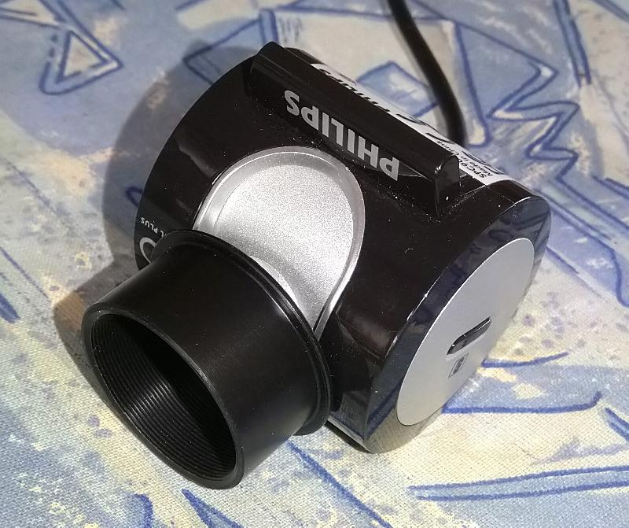

# A look back at my astronophotography shenanigans
###### 30/03/2022

A long, long time ago (no, really, it must have been 8 years since I layed a
hand on my telescope), I used to have enough time off to have multiple hobbies,
and one of these was astronomy. Now, I've always been interested in the vast
confines of space, be it the underlying mechanics of it, or, perhaps more
importantly for this post, in its looks.

Looking at beautiful things is nice... But isn't it better to record that experience ? 
To share and discuss it afterwards, or even to relive fond memories in your old days ?
And thus was born my passion for astrophotography.

If you want to skip straight to the eye candy, you may click [here](#eyecandy).

# How it worked
As one must know, astronomy is an expensive hobby. High grade optics, precision
equatorial mounts, all this equipment costs a hefty amount of money. I was
lucky enough to be gifted all that one lucky birthday, but astrophotography has
one more requirement : a camera. 

Usually, specialized cameras would have a CCD sensor, an adapted mounting
system for the focuser, perhaps a cooling system to reduce the sensor noise...
With a pricetag around 500 euros at least.

Then, there was the "other" way around. A few webcams (namely, Phillips'
SPC900NC and Sony's Vesta Pro --adequately named, I must say--) actually used
CCD sensors. 

Now, one had to find a way to attach it to the telescope. Back in the day,
argentic photography was also still a thing... or at least, had been enough of
a thing in the past decade that I could find film roll boxes littering the
house. What I didn't know at the time is that it was actually a pretty accepted
trick of the trade that these were in fact 31.75mm (1.25") in diameter, and
thus fitting perfectly on the telescope. 

Unscrew the lense, drill a hole in the case top, screw the lens back to attach
the webcam to the top of the case... There, done !

(okay, this one is a slightly less bootlegged version with a COTS adapter, which I later moved on to)

# What it looked like

## The Moon
Look up at night, what do you see ? Chances are, not much, because you most
likely live in a big city. But assuming you don't, you're probably seeing stars
and planets, but not much of these beautiful galaxies and nebula you were
promised. Why ?  Because there's that pesky white disk hanging around, bathing
the sky with a white, milky light. Well, that's the moon, and there's quite a
bit to see on it !

Usually, the moon is best looked at a week or so before or after the new moon.
Indeed, the moon only ever shows the same face to the sun, and that face is...
pretty flat and uninteresting. Rather, the so-called dark side of the moon is
littered with craters. At this time of the moon cycle, the sun lights up these
craters from the side, creating interesting shadows, thus allowing us to see
more clearly what we are looking at.

These pictures are mosaics of multiple pictures.

## Jupiter
Jupiter too was a prime target. During opposition periods, it presents a large
bright target, with a decent amount of details, and most notably its infamous
red spot (which I was lucky enough to miss everytime).

My first pictures were taken using a 130/900 Skywatcher refractor, in 2010 :

Then followed a few pictures showcasing Jupiter's satellites and itself, and a
shameful Paint montage merging two pictures with different exposure times.
Looking closely, we can already make out two stripes of the planet's atmosphere.

Much better pictures we obtained somewhere between 2012 and 2014 with a
Celestron C8 2032/203 Schmidt-Cassegrain refractor : 

## Saturn 
I also had been looking to set my sights on Saturn, ever since I had seen it in
a cool summer night in 2008. The iconic ringed planet...  Well, I managed to do
that twice in 2012 and 2014 :

Unfortunately, the pictures I have are of pretty poor quality.

# What next ? 
Some day, when I have time, I might come back to it with more, new pictures.
Perhaps touch on the basics of guidance, mounts, and astronomy-specific photo
editing. But that's for another time.

Stay tuned !

(Blessed be thee if you caught that Don McLean reference, too)
